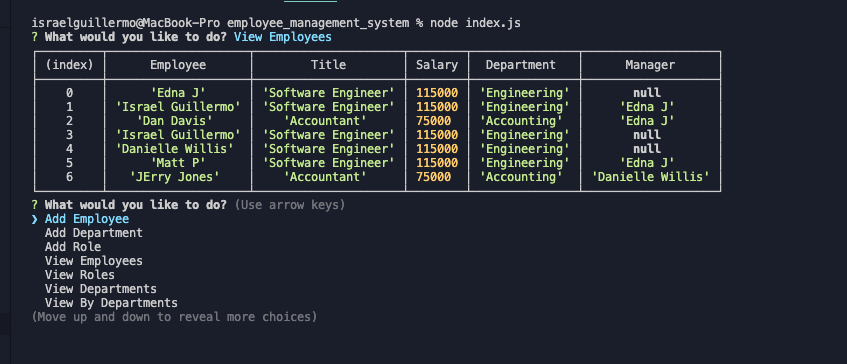

# employee_management_system

# Employee Management System

## Table of Contents

- [Description](#desciption)
- [Installation](#installation)
- [Usage](#Usage)
- [Contribution](#Contribution)
- [Test](#test)
- [License](#license)

## Description

 
This is a back end program which allows user to use the terminal to manage employees. The program has several functionalities which include, adding an employee, role and department. The program also allows the user to view employees, departments and roles. Additionally the program allows the user to view employees by roles and departments. Lastly this program allows the user to update the role of an employee.   This program uses node, inquirer, console.table and mysql packages which provides the user the ease of use.   The program stores all the data in a database by using mysql. when reading, updating or creating information the program pushes this to the 3 tables (employee, role, and department) found on the database.

## License

 
None

## Installation

npm i

## Usage

1. Open integrated terminal   2. Run node index.js 3. Follow the questions being prompted.

## Contribution

None

## Test

1. Open integrated terminal   2. Run node index.js  3. Follow the questions being prompted.

## For any additional questions please contact me at:

Email: israelguillermo22@gmail.com
 
GitHub: [IsraelGuillermo](https://github.com/IsraelGuillermo)
